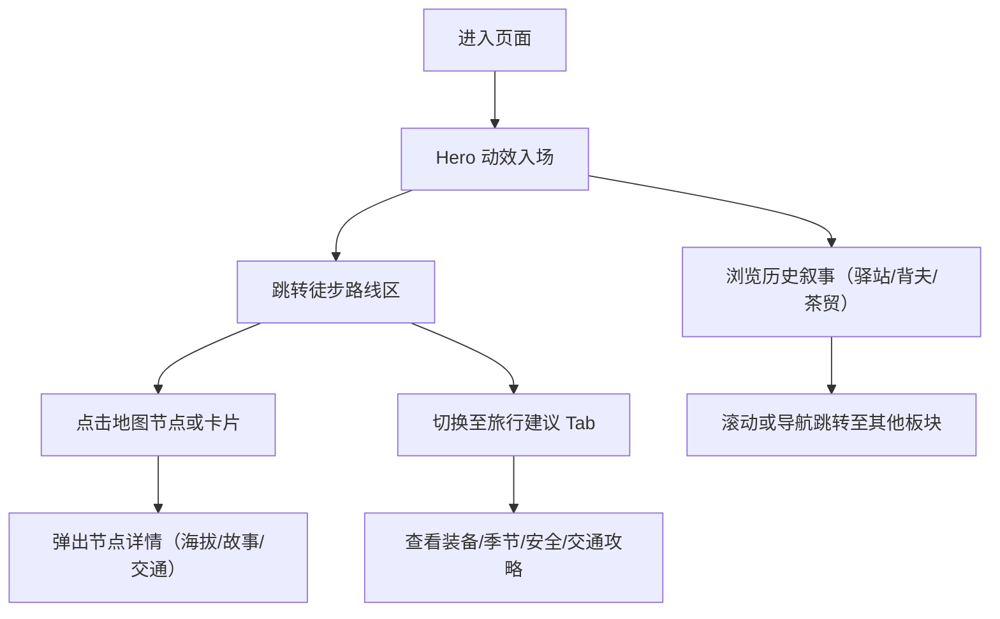

## 1. 产品概述

山地茶马古道专题网页——以历史叙事与旅行指南双线结构，讲述川滇藏茶马古道的驿站、背夫、茶叶贸易，并提供今日徒步路线信息。面向文化爱好者与徒步旅行者，兼顾知识深度与实用价值。

## 2. 核心功能

### 2.1 用户角色

| 角色 | 访问方式 | 核心需求 |
|------|----------|----------|
| 文化爱好者 | 直接访问 | 了解茶马古道历史、驿站故事、背夫文化 |
| 徒步旅行者 | 直接访问 | 获取路线节点、海拔数据、交通提示、旅行建议 |

### 2.2 功能模块

1. **首页 / Hero 区**：古道全景地图、老照片拼贴、主题介绍
2. **历史叙事区**：驿站节点、背夫故事、茶叶贸易三大板块
3. **徒步路线区**：交互式地图 + 节点卡片（含海拔、故事、交通）
4. **旅行建议区**：与历史叙事独立的装备、季节、安全指南
5. **节点详情弹层**：点击地图/卡片弹出详细信息

### 2.3 页面详情

| 页面名称 | 模块名称 | 功能描述 |
|----------|----------|----------|
| 首页 | Hero 区 | 全屏古道主题视觉 + 老照片拼贴 + 标题动效入场 |
| 首页 | 导航栏 | 固定顶部锚点导航：驿站 / 背夫 / 茶贸 / 路线 / 攻略 |
| 首页 | 驿站板块 | 时间线式 6-8 个重要驿站，各含海拔、历史故事、老照片 |
| 首页 | 背夫板块 | 人物群像 + 口述历史摘录 + 背夫装备与路线说明 |
| 首页 | 茶叶贸易板块 | 茶品种类 + 贸易路线图 + 交易流程与茶税历史 |
| 首页 | 徒步路线区 | 交互式 SVG 地图 + 可点击节点 + 侧边路线信息卡 |
| 首页 | 旅行建议区 | 独立 Tab：装备清单 / 季节推荐 / 安全须知 / 交通接驳 |
| 首页 | 节点弹层 | 点击任意节点弹出大图 + 完整故事 + 交通提示 |

## 3. 核心流程

## 4. 用户界面设计

### 4.1 设计风格

- **主色**：泥土赭石 `#8B5A2B` + 深茶褐 `#3E2723` + 羊皮纸米白 `#F5ECD7`
- **辅色**：经幡蓝 `#1565C0`、松绿 `#2E7D32`、酥油金 `#F9A825`
- **按钮样式**：衬线细边 + 轻微做旧纹理，hover 时金粉浮动效果
- **字体**：标题用「思源宋体 Heavy」或「Noto Serif SC Black」，正文用「思源宋体 Regular」，数据数字用等宽衬线体
- **布局风格**：杂志式跨栏 + 老照片留白拼贴 + 地图固定锚点布局
- **视觉元素**：羊皮纸纹理背景、老照片折痕/泛黄滤镜、手写印章、虚线路线、复古地图装饰元素

### 4.2 页面设计概览

| 页面名称 | 模块名称 | UI 元素 |
|----------|----------|----------|
| 首页 | Hero 区 | 全屏宽幅风景照（灰度叠加赭石色）+ 大号衬线标题 + 三张老照片悬浮错落 + 向下滚动箭头 |
| 首页 | 导航栏 | 半透明羊皮纸背景 + 宋体导航文字 + 当前章节下划线标记 |
| 首页 | 驿站板块 | 左侧垂直时间线（虚线 + 节点圆点）+ 右侧交替卡片布局（老照片 + 文字块 + 海拔标签） |
| 首页 | 背夫板块 | 深色背景 + 人物肖像圆形裁剪 + 口述引用双引号大号装饰 + 背篓绳索纹理装饰 |
| 首页 | 茶贸板块 | 左图右文分栏 + 茶饼/茶具细节特写 + 贸易流向虚线箭头图 |
| 首页 | 徒步路线区 | 左侧 SVG 古道地图（节点可点击高亮）+ 右侧路线节点列表卡片 + 海拔剖面图 |
| 首页 | 旅行建议区 | 4 个 Tab 切换（带图标）+ 卡片式清单列表 + 注意事项黄色提示框 |
| 首页 | 节点弹层 | 毛玻璃背景 + 顶部大图 + 海拔徽章 + 故事正文 + 交通提示绿色边框卡片 |

### 4.3 响应式设计

- 桌面优先（1280px+），三栏布局：地图 + 节点列表 + 详情
- 平板（768-1279px）：上下分栏，地图与列表纵向堆叠
- 移动端（<768px）：单栏全宽，地图缩小可缩放，Tab 改为底部滚动选择
- 触摸设备：节点点击区域 ≥ 44px，弹层支持下滑关闭

### 4.4 动效与交互

- 入场：Hero 标题逐字显现，老照片错落延迟淡入
- 滚动触发：各板块使用 IntersectionObserver 触发元素从左右滑入
- 地图交互：hover 节点放大 + 路线高亮，点击后脉冲动画
- Tab 切换：内容区块淡入 + 下划线滑动过渡
- 图片：老照片加载时显示素描占位图，加载后交叉淡入
