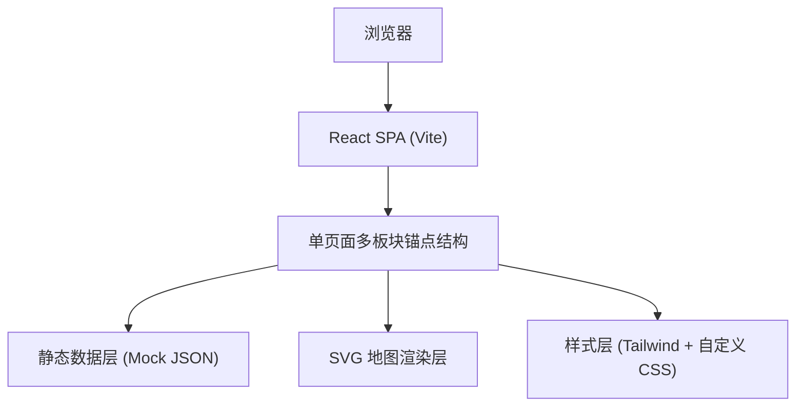

## 1. 架构设计



## 2. 技术栈说明

- **前端框架**：React@18 + TypeScript
- **构建工具**：Vite@5
- **样式方案**：Tailwind CSS@3 + PostCSS（自定义主题变量）
- **路由**：无（单页锚点导航），使用 React Router 可选
- **图标**：Lucide React（线性图标，适配复古风）
- **图片处理**：使用 text_to_image API 生成老照片风格配图
- **地图**：内嵌 SVG 手绘风格茶马古道路线图
- **动效**：纯 CSS Animations + Transitions + IntersectionObserver

## 3. 页面路由定义

| 路由 / 锚点 | 用途 |
|-------------|------|
| #hero | 首页主题区 |
| #stations | 驿站历史 |
| #carriers | 背夫文化 |
| #trade | 茶叶贸易 |
| #route | 今日徒步路线 |
| #tips | 旅行建议（与历史叙事独立区块） |

## 4. 核心数据结构

### 4.1 驿站节点数据 (Station)

```typescript
interface Station {
  id: string;
  name: string;           // 驿站名称
  chineseName: string;    // 中文名
  altitude: number;       // 海拔（米）
  location: { lat: number; lng: number };
  mapPosition: { x: number; y: number }; // SVG 坐标百分比
  story: string;          // 历史故事
  photo: string;          // 老照片 URL
  transportTip: string;   // 交通提示（今日）
  era: string;            // 兴盛时期
  isOnRoute: boolean;     // 是否在今日徒步路线上
}
```

### 4.2 背夫人物 (Carrier)

```typescript
interface Carrier {
  id: string;
  name: string;
  nickname: string;       // 绰号/称号
  origin: string;         // 籍贯
  portrait: string;       // 肖像
  story: string;          // 口述/记载故事
  cargo: string;          // 背负货物
  route: string;          // 常走路段
}
```

### 4.3 茶品贸易 (TeaTrade)

```typescript
interface TeaTrade {
  id: string;
  teaName: string;
  origin: string;         // 产地
  destination: string;    // 销地
  priceEra: string;       // 当时价格
  tradeVolume: string;    // 交易量记载
  description: string;
  image: string;
}
```

### 4.4 徒步路线 (HikingRoute)

```typescript
interface HikingRoute {
  id: string;
  name: string;           // 路线名称
  duration: string;       // 建议天数
  difficulty: "easy" | "moderate" | "hard";
  totalDistance: number;  // km
  stations: string[];     // 经过的驿站 ID 列表
  elevationProfile: number[]; // 海拔数据点
  seasonRecommendation: string[];
  gearList: GearItem[];
  safetyNotes: string[];
  transportConnections: TransportTip[];
}

interface GearItem {
  category: string;
  items: string[];
  essential: boolean;
}

interface TransportTip {
  from: string;
  to: string;
  method: string;
  duration: string;
  note: string;
}
```

## 5. 组件架构

```
src/
├── App.tsx                    # 主入口 + 板块编排
├── main.tsx
├── index.css                  # Tailwind + 自定义复古主题
├── data/
│   ├── stations.ts            # 驿站 Mock 数据
│   ├── carriers.ts            # 背夫数据
│   ├── teaTrade.ts            # 茶贸数据
│   └── hikingRoutes.ts        # 徒步路线数据
├── components/
│   ├── layout/
│   │   ├── Hero.tsx           # Hero 主题区
│   │   ├── Navigation.tsx     # 固定导航栏
│   │   └── SectionWrapper.tsx # 通用板块容器
│   ├── stations/
│   │   ├── StationTimeline.tsx # 驿站时间线
│   │   └── StationCard.tsx     # 单个驿站卡片
│   ├── carriers/
│   │   └── CarrierGallery.tsx # 背夫群像
│   ├── trade/
│   │   └── TradeFlow.tsx      # 茶贸流向图
│   ├── route/
│   │   ├── RouteMap.tsx       # SVG 交互地图
│   │   ├── NodeList.tsx       # 节点列表
│   │   ├── ElevationChart.tsx # 海拔剖面图
│   │   └── NodeModal.tsx      # 节点详情弹层
│   ├── tips/
│   │   └── TravelTips.tsx     # 旅行建议 Tab 区
│   └── shared/
│       ├── AltitudeBadge.tsx  # 海拔徽章
│       ├── OldPhoto.tsx       # 老照片包装组件
│       └── TabSwitcher.tsx    # Tab 切换器
└── hooks/
    └── useScrollReveal.ts     # 滚动触发动效 hook
```

## 6. 性能与可访问性

- 图片懒加载（loading="lazy" + IntersectionObserver）
- SVG 地图内联，无外部请求
- 弹层使用 Portal，支持 Esc 关闭与焦点管理
- 语义化 HTML：`<article>` `<section>` `<nav>` `<aside>`
- 颜色对比度满足 WCAG AA（正文 ≥ 4.5:1）
- 所有交互元素提供键盘可达性
